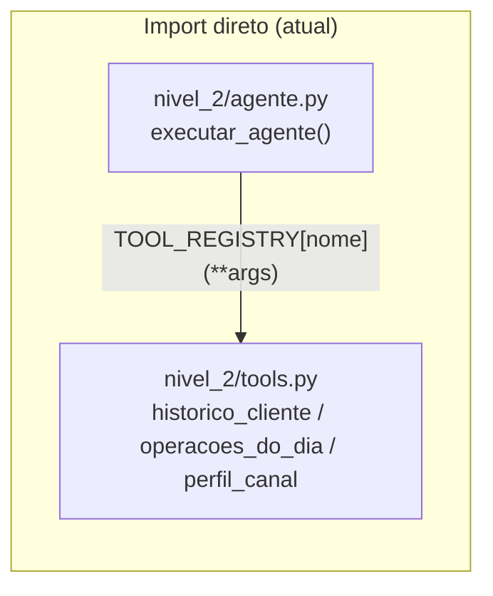
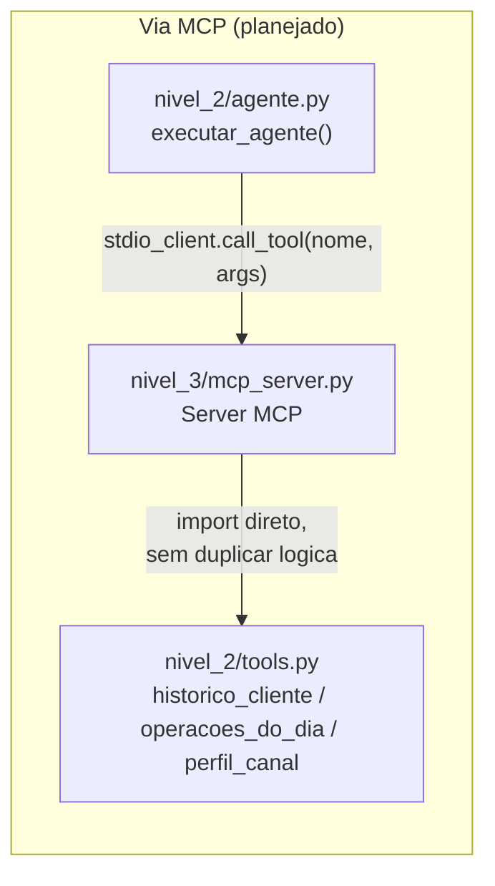

# Nível 3 — não implementado

Priorizei deixar os Níveis 1 e 2 sólidos e bem documentados em vez de um Nível 3 pela
metade, conforme a própria recomendação do enunciado do desafio. Esta página explica a
escolha da trilha e o plano de implementação com o nível de detalhe que eu usaria se
fosse de fato começar a trilha amanhã.

## Por que a Trilha B (Servidor MCP) e não A ou C

| Trilha | Por que não |
|---|---|
| **A — Fluxo multiagente** (Triador → Investigador → Redator) | Exigiria orquestrar estado compartilhado entre três papéis e definir condição de parada — trabalho novo de arquitetura, não uma extensão do que já existe. O ganho de qualidade sobre o agente único atual (que já decide sozinho quais ferramentas chamar) é incerto sem dados reais para comparar as duas abordagens. |
| **C — Interface conversacional** (Streamlit/Gradio/Chainlit) | É a trilha mais vistosa, mas também a mais distante do que o desafio avalia como núcleo técnico (separação regra/LLM, agente, confronto). Adicionaria uma camada de UI e gerência de memória de conversa sem reforçar nada que já foi construído. |
| **B — Servidor MCP** ✅ | É a única trilha que **reaproveita** o que já existe em vez de construir por cima. `nivel_2/tools.py` já expõe `historico_cliente`, `operacoes_do_dia` e `perfil_canal` como funções puras, sem estado, com schemas de parâmetro já definidos em `nivel_2/agente.py` (`TOOL_SCHEMAS`). Expô-las via MCP é trocar o transporte (import direto → stdio), não reescrever a lógica de negócio. |

## Arquitetura planejada

Hoje o agente chama as ferramentas por import direto, dentro do mesmo processo:

Com a Trilha B, as mesmas três funções passam a rodar num processo servidor separado,
falado por stdio — o agente vira um cliente MCP em vez de um chamador de função Python:

O ponto central: `nivel_2/tools.py` não muda em nenhuma das duas versões. Só a camada
de transporte entre `agente.py` e as ferramentas muda.

## Passos concretos

1. **`nivel_3/mcp_server.py`**: instanciar um `Server` do SDK `mcp` (pacote `mcp`,
   `from mcp.server import Server`), registrar três `@server.tool()` que chamam
   `historico_cliente`, `operacoes_do_dia` e `perfil_canal` de `nivel_2.tools` sem
   alterar as assinaturas — o servidor é uma casca fina em cima do que já existe.
   Reaproveitar `TOOL_SCHEMAS` de `nivel_2/agente.py` para gerar as descrições MCP em
   vez de redigitar os schemas.
2. **Rodar o servidor via stdio**: `python -m nivel_3.mcp_server`, seguindo o padrão
   stdio do protocolo MCP (sem servidor HTTP, sem porta exposta — mais simples de
   documentar "como conectar" e mais alinhado ao que o enunciado pede).
3. **Adaptar `nivel_2/agente.py`**: trocar `TOOL_REGISTRY[nome](**argumentos)` (chamada
   direta) por uma chamada via `stdio_client` do SDK `mcp` que abre um subprocesso para
   `nivel_3/mcp_server.py` e invoca a ferramenta por protocolo. Isso fica atrás de uma
   flag (`USAR_MCP=1` no `.env`, por exemplo) para não quebrar a execução por import
   direto que já está testada e commitada.
4. **Documentar como conectar**: um `nivel_3/README.md` atualizado (esta página) com o
   comando exato para subir o servidor e o client MCP genérico (ex: MCP Inspector) para
   testar as três ferramentas isoladamente, fora do agente.

## Como eu validaria

Rodar o mesmo lote de 10 clientes (`outputs/top_10_clientes.csv`) duas vezes — uma com
`TOOL_REGISTRY` por import direto (como está hoje) e outra com o agente falando por MCP
— e comparar os dois `outputs/lote.csv` linha a linha. Como a lógica de negócio em
`nivel_2/tools.py` é a mesma nos dois casos, os pareceres devem ser **idênticos**
(mesmo `nivel_risco`, mesmas `red_flags`); qualquer diferença apontaria um bug na
camada de transporte MCP, não nas regras ou no prompt.

Critério de pronto: os dois lotes batem 100%, e o servidor MCP responde corretamente a
uma chamada isolada de cada uma das três ferramentas via um client MCP genérico (não só
através do agente), confirmando que ele funciona como uma ferramenta MCP de verdade e
não só como um encanamento particular do meu próprio agente.

Versão condensada desta mesma decisão: `docs/DECISOES.md`, seção "O que seria feito com
mais tempo", item 4.
